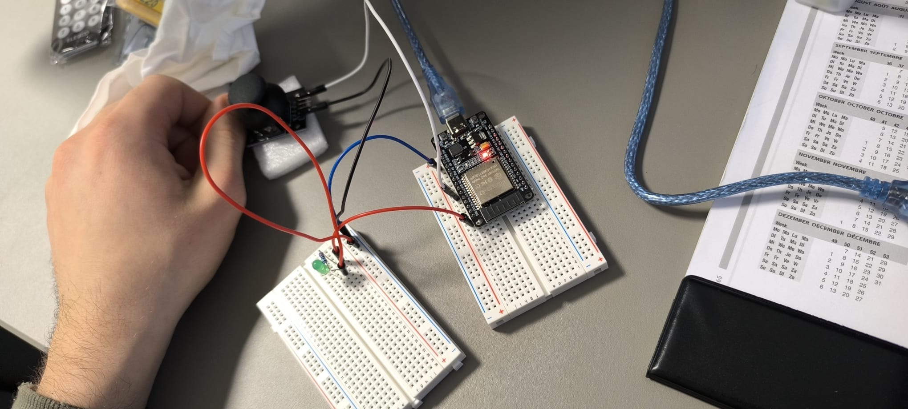
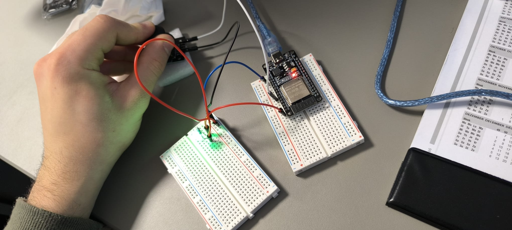

# ESP32 Joystick LED

My first ESP32 input/output project.
The LED lights up while the joystick button is pressed.

## Wiring

- Joystick SW → GPIO18
- Joystick GND → ESP32 GND
- GPIO23 → 220Ω resistor → LED anode (+)
- LED cathode (-) → ESP32 GND

## Usage

Open esp32-joystick-led.ino in Arduino IDE.
Select your ESP32 board and port, then upload.

## What I learned

GPIO input/output, INPUT_PULLUP, digitalRead(),
digitalWrite(), and common ground.

This Promt created with google translate heheheheh

## Circuit photo

## Circuit Photos

## Circuit Photos

